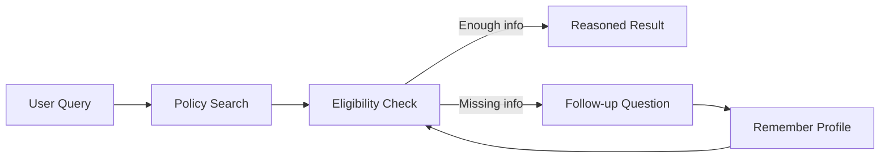

<div align="center">

# 🧭 Youth Policy Navigator

### 청년 정책 검색·자격 판정을 위한 MCP Server

**Search → Eligibility Check → Missing Info → Memory → Re-evaluation**


**Kakao PlayMCP 공모전 프로젝트**

</div>

청년 정책·지원금을 단순 검색하는 데서 끝나지 않고, **사용자의 상황과 정책 조건을 비교해 적격 / 부적격 / 정보부족을 이유와 함께 판정**하는 MCP 서버입니다.

## Why this project?

| Feature | What it does |
|---|---|
| 🔎 **Hybrid Search** | 온통청년 API + 내장 corpus를 Contextual BM25로 검색 |
| ✅ **Deterministic Eligibility** | 나이·지역·소득·취업 상태를 구조화 조건으로 판정 |
| ❓ **Missing-info Loop** | 정보가 부족하면 다음 질문을 만들어 host LLM이 되묻게 함 |
| 🧠 **User Memory** | SQLite에 사용자 상황을 저장하고 필요한 정보를 회상 |
| 🧩 **MCP Tools** | 자연어 생성은 host LLM, 데이터·판정은 server가 담당 |

## Agent Loop



서버가 “답변 문장”을 마음대로 생성하지 않고, **근거 데이터와 결정론적 판정 결과**를 제공하도록 역할을 분리한 것이 핵심입니다.

## MCP Tools

| Tool | Role |
|---|---|
| `search_youth_policies` | 정책 검색 |
| `check_eligibility` | 사용자 조건 기반 자격 판정 |
| `get_policy_detail` | 신청 방법·기간·서류·URL |
| `remember_user_profile` | 사용자 상황 저장 |
| `recall_user_profile` | 관련 사용자 정보 회상 |

## Example

1. “월세 지원 정책 찾아줘” → 관련 정책 검색
2. 자격 판정에 소득 정보가 부족함 → `needs_more_info`
3. host LLM이 소득 정보를 질문
4. 답변을 memory에 저장
5. 동일 정책을 다시 판정 → `eligible / ineligible / manual_review`

## Quick Start

```bash
uv sync --extra dev
uv run pytest -q

# local stdio
uv run policy-mcp

# remote HTTP
MCP_TRANSPORT=http uv run policy-mcp
```

Docker:

```bash
docker build --platform linux/amd64 -t policy-mcp .
```

API key가 없어도 내장 corpus 기반 mock으로 동작합니다.

<details>
<summary><b>Live 온통청년 API 사용하기</b></summary>

`.env`에 발급받은 정책 API 키를 설정합니다.

```env
YOUTHCENTER_API_KEY_POLICY=your_api_key
```

2026-07 기준 신규 API 규격을 실제 발급키로 검증했습니다. 정책 조건은 공고에 따라 변동될 수 있으므로 최종 신청 전 원문 공고 확인이 필요합니다.

</details>

## Project Structure

```text
src/policy_mcp/
├── server.py          # FastMCP server / tools
├── policies.py        # search service
├── eligibility.py     # deterministic eligibility engine
├── policy_corpus.py   # built-in policy corpus
├── memory.py          # SQLite + BM25 memory
├── retrieval.py       # Contextual BM25
└── clients/           # Youth Center API client

tests/                 # 48 offline tests
```

## Design Principle

> **LLM은 해석과 대화를 담당하고, eligibility decision은 재현 가능한 코드가 담당한다.**

이 구조를 통해 정책 검색 결과가 바뀌더라도 자격 판정 과정과 근거를 추적하기 쉽게 만들었습니다.
